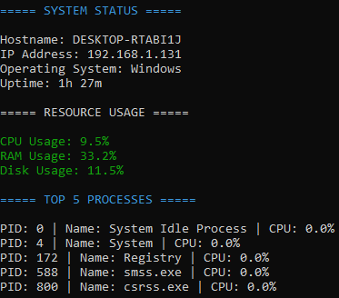

# Linux System Monitor


A lightweight Linux system monitoring tool developed in Python.  
This project collects and displays real-time system information, resource usage statistics, and top running processes directly from the terminal.

## Features

- System information display
  - Hostname
  - Local IP address
  - Operating system
  - System uptime

- Resource monitoring
  - CPU usage
  - RAM usage
  - Disk usage

- Process monitoring
  - Top 5 processes by CPU consumption

- Logging
  - Automatic log generation in `.txt` format

- Visual alerts
  - Color-coded usage indicators using `colorama`

---

## Technologies Used

- Python 3
- psutil
- colorama

---

## Project Structure

```bash
linux-system-monitor/
│
├── monitor.py
├── requirements.txt
├── README.md
│
├── logs/
│   └── system_log.txt
│
└── screenshots/
    └── demo.png
```

---

## Installation

Clone the repository:

```bash
git clone https://github.com/Marcos533-stack/linux-system-monitor.git
```

Move into the project directory:

```bash
cd linux-system-monitor
```

Install dependencies:

```bash
pip install -r requirements.txt
```

---

## Usage

Run the script:

```bash
python monitor.py
```

---

## Example Output

```text
===== SYSTEM STATUS =====

Hostname: DESKTOP-01
IP Address: 192.168.1.15
Operating System: Linux
Uptime: 5h 12m

===== RESOURCE USAGE =====

CPU Usage: 34%
RAM Usage: 62%
Disk Usage: 71%
```

---

## Screenshot

Add your terminal screenshot here:



---

## Future Improvements

- JSON export support
- Real-time continuous monitoring
- Email alerts
- Integration with monitoring tools
- Historical metrics tracking

---

## Purpose of the Project

This project was created to strengthen practical skills related to:

- Python scripting
- Linux system administration
- Resource monitoring
- Troubleshooting
- Basic infrastructure observability
